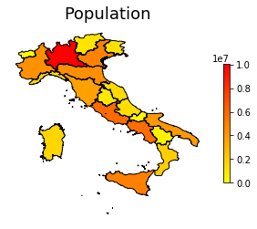

# Shapefile to geoJSON

The `shp2geoJSON` python module is a set of tools to convert geographical data from shapefiles to `geoJSON` format (and add graphical information such as color and opacity to the shapes).

`geoJSON` is a popular format for encoding of geographic data structures, which can be directly used to visualize data on the web with tools such as [Leaflet](https://leafletjs.com/examples/geojson/).

With this module it is possible to load a shapefile, add graphic informations based on data, plot the result in python and export it as geoJSON.

A plot created with this module:



# Download and instal
Clone this repo, open a terminal, move to the repository root and run
`pip install .`

# Usage
Have a look at the [example python-notebook](https://mpascucci.github.io/python-geoJSON/) in the project's `docs/` folder for a complete use-case.


### basic Usage
```python
import shp2geoJSON as geoJ

# load shapefile
features = geoJ.shapefile2geoJSON_features(shp_path)

# [do something with the data here, if you need]

# save as geoJSON
with open("geo_data.json", "w") as f:
  f.write(dumps(features))
```
